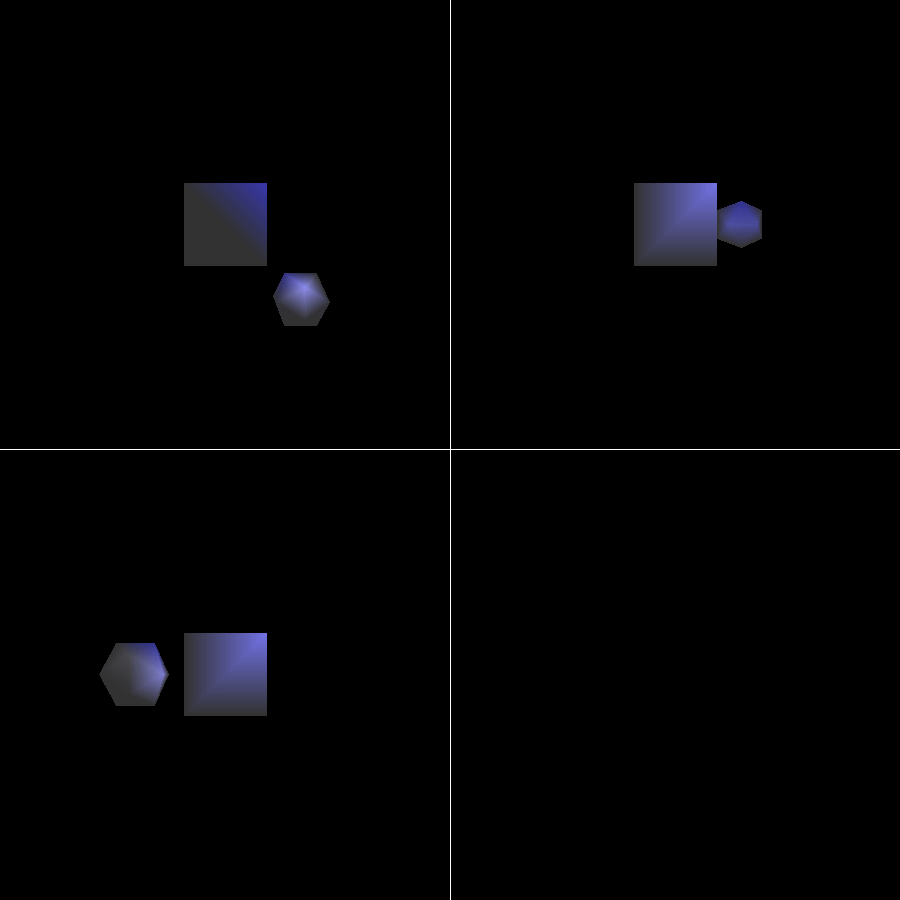

# ECS175
* Computer Graphics class homework demo

## License
The actual homeworks are closed source, to avoid plagiarism. Only executables
are provided (runs on CSIF, likely to run on other x86_64 Linux machines).

The scripts that generate animation using the homework are open source (`*.py`
and `*.sh`), under GNU Affero General Public License version 3.

The README files are under
[Creative Commons Attribution-NonCommercial-NoDerivatives 4.0 International License](http://creativecommons.org/licenses/by-nc-nd/4.0/).

The 3D models used in this homework is provided by the instructor / TA, and I am
not sure about the real soruce of these models. One of them used seems to be
the [Stanford Bunny](http://graphics.stanford.edu/data/3Dscanrep/).

## Demos
### Table of Contents
* [Project 1](#Project-1)
* [Project 2](#Project-2)
* [Project 3](#Project-3)
* [Project 4](#Project-4)
* [Project 5](#Project-5)

### [Project 1](Project1)

```
cd Project1
./Project1
# press Shift+K
```


```
cd Project1
./Project1
# press F, then press Shift+K
```

### [Project 2](Project2)

```
cd Project2
./camera.py
```


```
cd Project2
./HCC.py
```


```
cd Project2
./rotate.py
```


```
cd Project2
./yaki_rabbit.sh
```

### [Project 3](Project3)

```
cd Project3
./anime_bunny.sh 3
```


```
cd Project3
./anime_camera.sh
```


```
cd Project3
./anime_rotate.sh
```

### [Project 4](Project4)

```
cd Project4
./Project4
```

### [Project 5](Project5)

```
cd Project5
./anime_camera.py scene0
```


```
cd Project5
./anime_camera.py scene1
```


```
cd Project5
./anime_camera.py scene5
```


```
cd Project5
./anime_camera.py scene6
```

More: [Project5/png](Project5/png)

